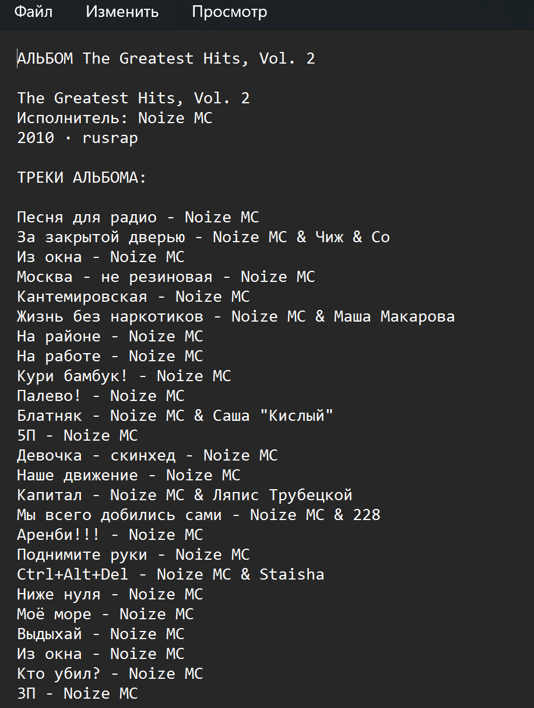

**Работа с API Яндекс Музыки**

Скрипт, который собирает информацию об альбоме по его ID
и выводит информацию об альбоме, список песен и исполнителя.

_`Входные данные:`_

В файле ".env" указывается ваш токен **TOKEN_YM** 
(можно получить с помощью [расширения Crome](https://chromewebstore.google.com/detail/yandex-music-token/lcbjeookjibfhjjopieifgjnhlegmkib)) и ID альбома **ALBUM_ID**.

`Выходные данные:`

Общая информация об альбоме, список песен и исполнитель в файле .txt

